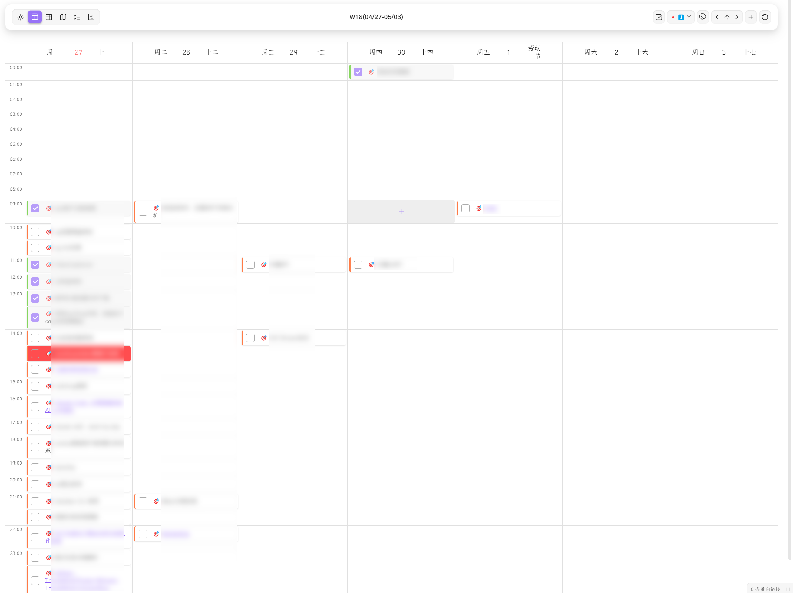
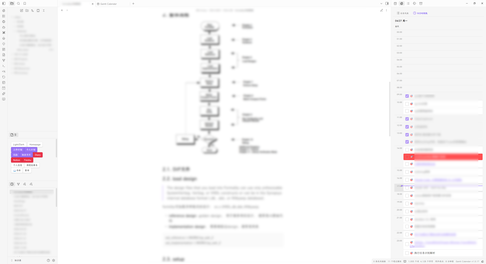
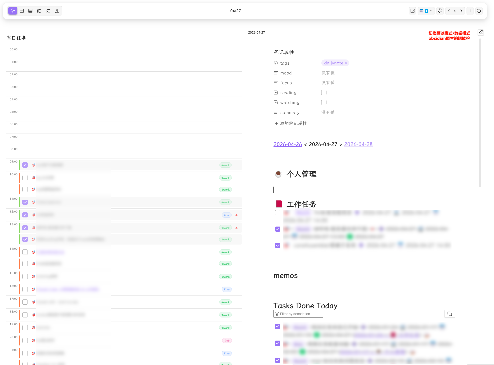

# Obsidian Gantt Calendar

<div align="center" style="padding: 20px; border: 2px solid #8b5cf6; border-radius: 12px; background: linear-gradient(135deg, rgba(139, 92, 246, 0.05) 0%, rgba(59, 130, 246, 0.05) 100%); margin: 20px 0;">

✨ 一个强大的 Obsidian 任务管理和日历插件 ✨

🗓️ **多视图日历** - 任务视图/日历视图(年月周日)/甘特图/侧边栏 六大视图自由切换

🏮 **节日显示** - 公历/农历节日和二十四节气显示

📊 **数据可视化** - 任务热力图、每日任务数量统计、8种渐变配色方案

✅ **智能任务管理** - 全局筛选、优先级标记、6种时间属性、时间精度(HH:mm)

⏱️ **时间轴视图** - 日/周视图支持24小时时间轴布局，拖拽+快速创建

📝 **Daily Note 集成** - 嵌入式编辑器，编辑/预览模式切换

📡 **侧边栏视图** - 任务搜索筛选排序 + 每日时间线

🎨 **高度可定制** - 节日颜色、热力图配色、任务显示数量等全面配置

🔗 **双格式兼容** - 完美支持 Tasks 插件（emoji）与 Dataview 插件（字段）格式

🔁 **周期任务** - 支持 daily/weekly/monthly/yearly 重复任务显示

</div>

---

## Screenshots

YearView


Gantt View


Week Timeline View (时间轴模式)


Sidebar View (任务列表 + 每日时间线)


Day View with Embedded Editor (嵌入式编辑器)


## 🚀 Quick Start

### 安装插件

#### 使用`BRAT`插件安装:
1. 下载并启用社区插件 `BRAT`
2. 执行命令 `Add a beta plugin for testing (with or without version)`
3. 填写仓库地址: https://github.com/sustcsugar/obsidian-gantt-calendar


#### 手动安装
1. 下载最新的 [Release](https://github.com/sustcsugar/obsidian-gantt-calendar/releases)
2. 解压后将文件夹复制到 `<你的库>/.obsidian/plugins/`
3. 重启 Obsidian 并在设置中启用插件

### 打开视图

**点击侧边栏按钮**
- 通过侧边栏按钮打开插件的视图页面.

**视图切换**
- 在工具栏左侧点击**视图切换按钮**快速切换

### 工具栏添加任务
- 工具栏右侧功能区,使用**添加任务**按钮, 创建任务.

### 手动创建任务
> 通过quickadd/tasks插件,进行任务的创建

在任何 Markdown 文件中输入：
```markdown
- [ ] 🎯 完成项目文档 📅 2025-12-20
```

刷新插件即可在日历和任务列表中看到该任务！


## 📋 主要功能

### 界面布局

插件采用顶部工具栏 + 内容区的布局结构：

**工具栏（Toolbar）** - 分为左/中/右三个区域：
- **左侧**：视图切换(六大视图切换)
- **中间**：当前日期(范围)/标题显示
- **右侧**：功能按钮

---

### 任务格式

**Tasks 插件格式（Emoji）**
```markdown
- [ ] 🎯 完成项目文档 ⏫ ➕ 2025-01-10 📅 2025-01-15
```

| Emoji | 含义 | Emoji | 含义 |
|-------|------|-------|------|
| `🎯` | 全局标记 | `🔺` | 最高优先级 |
| `⏫` | 高优先级 | `🔼` | 中优先级 |
| `🔽` | 低优先级 | `⏬` | 最低优先级 |
| `➕` | 创建日期 | `🛫` | 开始日期 |
| `⏳` | 计划日期 | `📅` | 截止日期 |
| `✅` | 完成日期 | `❌` | 取消日期 |
| `🔁` | 重复任务 | - | - |

**Dataview 插件格式（字段）**
```markdown
- [ ] 🎯 完成项目文档 [priority:: high] [created:: 2025-01-10] [due:: 2025-01-15]
```

| 字段 | 含义 | 字段 | 含义 |
|------|------|------|------|
| `priority::` | 优先级 | `created::` | 创建日期 |
| `start::` | 开始日期 | `scheduled::` | 计划日期 |
| `due::` | 截止日期 | `completion::` | 完成日期 |
| `cancelled::` | 取消日期 | `repeat::` | 重复规则 |

**时间精度**
- 日期格式：`YYYY-MM-DD`（如 `2026-04-27`）
- 时间格式：`YYYY-MM-DD HH:mm`（如 `2026-04-27 14:00`）
- 包含时间的任务会自动在日视图和周视图中显示为时间轴布局

**重复任务语法**
```markdown
🔁 every day          # 每天
🔁 every 3 days       # 每3天
🔁 every week on Monday  # 每周一
🔁 every month on 15  # 每月15日
🔁 every year on 01-01  # 每年1月1日
🔁 every weekday      # 每个工作日
🔁 when done          # 完成后重新开始
```

**任务属性说明**
1. **全局筛选标记**：必须在复选框后开头位置，用于筛选特定任务
2. **任务描述**：纯文本内容，属性标记会自动清理
3. **优先级**：6 个等级（highest/high/medium/normal/low/lowest）
4. **时间属性**：6 种可选日期（格式 `YYYY-MM-DD` 或 `YYYY-MM-DD HH:mm`）

---

### 年视图
- **全年概览**：12 个月卡片展示全年任务分布
- **任务热力图**：5 级颜色梯度，直观显示任务密度
  - 8 种配色方案：蓝/绿/红/紫/橙/青/粉/黄
  - 3D 热力图效果
- **响应式布局**：根据窗口宽度自动切换 4×3 / 3×4 / 2×6 / 1×12 布局
- **任务数量统计**：可选显示每日任务总数
- **农历显示**：月卡片内显示农历日期
- **点击交互**：点击日期切换到日视图

### 月视图
- **月度日历**：标准月历布局，清晰显示每日任务
- **任务列表**：每天显示指定数量的任务（可配置 1-10 个）
- **任务弹窗**：点击日期显示当天完整任务列表
- **节日显示**：阳历节日、农历节日、节气三色标记
- **拖拽排序**：支持拖拽任务卡片在日期间移动
- **周期任务**：自动显示重复任务的虚拟实例
- **周起始配置**：支持周一/周日开始

### 周视图
- **双模式布局**：
  - **列表模式**：当周内无定时任务时，按天显示任务列表
  - **时间轴模式**：当存在带时间的任务时自动切换，显示 24h 纵向时间轴，7 天并排，行列完美对齐
- **今日高亮**：当天日期特殊标记
- **灵活导航**：上一周/本周/下一周快速切换
- **拖拽交互**：拖拽任务卡片到任意天/小时格
- **快速创建**：空时间格悬停显示"+"按钮，点击快速创建任务
- **农历信息**：日期旁显示农历文本和节日

### 日视图
- **详细任务列表**：显示当天所有任务详情
- **时间轴布局**：当任务包含时间精度（HH:mm）时，自动显示 0:00-23:00 时间轴，任务定位到对应小时格
- **拖拽交互**：拖拽任务到任意时间格调整时间
- **快速创建**：空时间格悬停显示"+"按钮，点击快速创建任务
- **Daily Note 集成**：
  - 嵌入式完整编辑器（WorkspaceSplit 模式）
  - 编辑/预览模式切换按钮
  - 动态显示当前笔记文件名
  - 水平布局（左右分屏）：任务在左，笔记在右
  - 垂直布局（上下分屏）：任务在上，笔记在下
- **农历信息栏**：显示农历日期、节日、节气
- **任务跳转**：点击任务直接定位到源文件

### 任务视图
- **任务列表**：集中展示所有任务
- **时间字段筛选**：按 6 种时间字段过滤任务
- **日期范围模式**：全部 / 今天 / 本周 / 本月 / 自定义范围
- **多维筛选**：状态、优先级、标签筛选
- **排序**：支持多种排序方式
- **筛选状态持久化**：刷新后保留筛选配置

### 甘特视图
- **交互式甘特条**：
  - 拖动整体任务条调整时间
  - 拖动左右端点调整开始/结束时间
  - 点击任务条跳转到源文件
- **导航按钮**：快速跳转到今天 / 向左 / 向右
- **增量刷新**：智能更新策略，避免全量重绘
- **标签/状态筛选**：按标签和任务状态过滤甘特条

---

### 侧边栏视图

侧边栏视图提供两个标签页，方便随时查看和管理任务：

**任务列表**
- 关键词搜索
- 多维筛选：状态、优先级、标签（OR/AND 运算）、日期（全部/今天/本周/本月）
- 排序：优先级 / 截止日期 / 开始日期
- 点击任务卡片直接跳转到源文件

**每日时间线**
- 24 小时时间格展示今日定时任务
- 全天任务区域（无具体时间的任务）
- 当前时间指示线（实时标记当前时刻）
- 拖拽任务调整时间
- 空时间格悬停快速创建

---

### 交互功能

**右键菜单**
- 编辑任务（弹窗编辑）
- 创建任务笔记（同名 / 别名）
- 设置优先级（最高/高/中/普通/低/最低）
- 设置任务状态：重要 🔴 / 有疑问 🟠
- 延期任务（1/3/7 天，支持"推迟"和"设置截止日期"两种方式）
- 取消 / 恢复任务
- 删除任务

**任务悬浮窗**
- 鼠标悬停显示任务详细信息

**拖拽操作**
- 月视图：拖拽任务卡片在日期间移动
- 周视图：拖拽任务到任意天/小时格
- 日视图：拖拽任务到任意时间格
- 侧边栏：拖拽任务调整时间

---

## 📅 开发路线图

### 任务解析
- ✅ 支持 Tasks 和 Dataview 双格式任务解析
- ✅ 完整的任务属性支持
    - ✅ 任务全局筛选符号
    - ✅ 任务标签属性
    - [ ] 嵌套标签识别
    - ✅ 任务描述
    - ✅ 任务6种优先级
    - ✅ 任务6种时间属性
    - ✅ 任务时间精度（HH:mm）
    - ✅ 重复任务识别与显示
- [ ] 换行任务识别
- [ ] 子任务识别
- [ ] 任务依赖关系

### 视图功能
- ✅ 日视图 Daily Note 集成（嵌入式编辑器，编辑/预览切换）
- ✅ 日视图时间轴布局
- ✅ 周视图双模式（列表 + 时间轴）
- ✅ 周视图/月视图卡片拖动
- ✅ 年视图任务热力图和数量统计
- ✅ 任务视图（多维筛选 + 日期范围）
- ✅ 甘特图（拖动 + 增量刷新 + 导航）
- ✅ 侧边栏视图（任务列表 + 每日时间线）

### 工具栏功能
- ✅ 工具栏视图切换
- ✅ 标签/状态/优先级筛选
- ✅ 日期导航按钮
- ✅ 时间字段筛选
- ✅ 添加任务按钮

### 交互功能
- ✅ 任务卡片（描述/标签/优先级）
- ✅ 任务右键菜单（编辑/创建笔记/优先级/状态/延期/取消/删除）
- ✅ 任务悬浮窗
- ✅ 空时间格悬停快速创建

### 💡 未来计划（v2.0.0）
- [ ] 订阅第三方日历
    - [ ] 飞书日历
    - [ ] Outlook 日历
- [ ] 第三方任务同步
    - [ ] 飞书任务
    - [ ] Microsoft To Do

---

### 贡献指南
欢迎提交 Issue 和 Pull Request！


## 📄 许可证

MIT License - 详见 [LICENSE](LICENSE) 文件

---

<div align="center">

💡 **遇到问题或有建议？** 欢迎提交 [Issue](https://github.com/sustcsugar/obsidian-gantt-calendar/issues)

⭐ **喜欢这个插件？** 请给我一个 Star！

</div>
