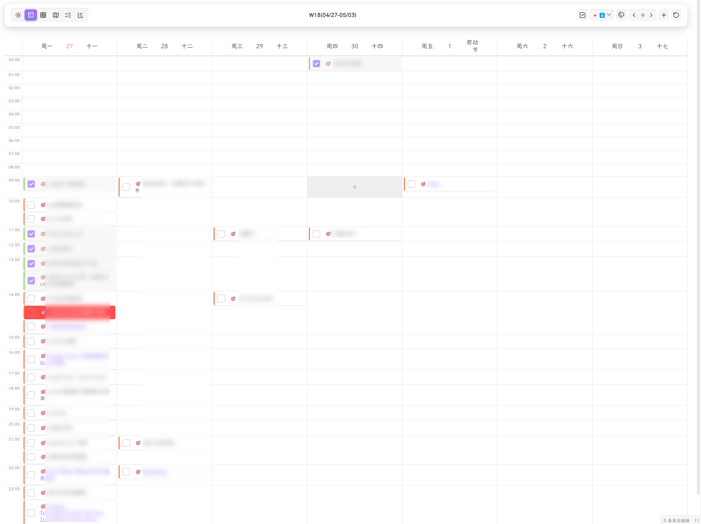
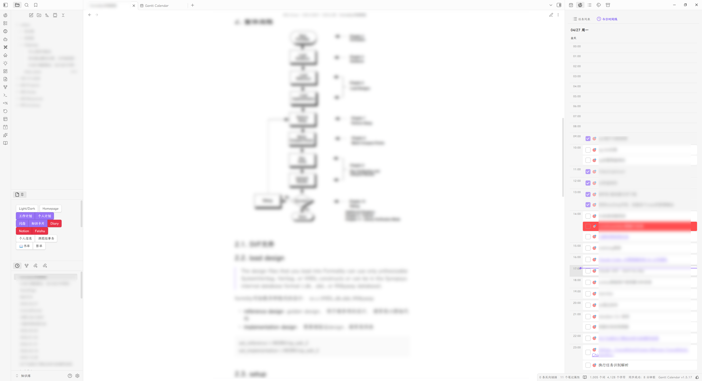
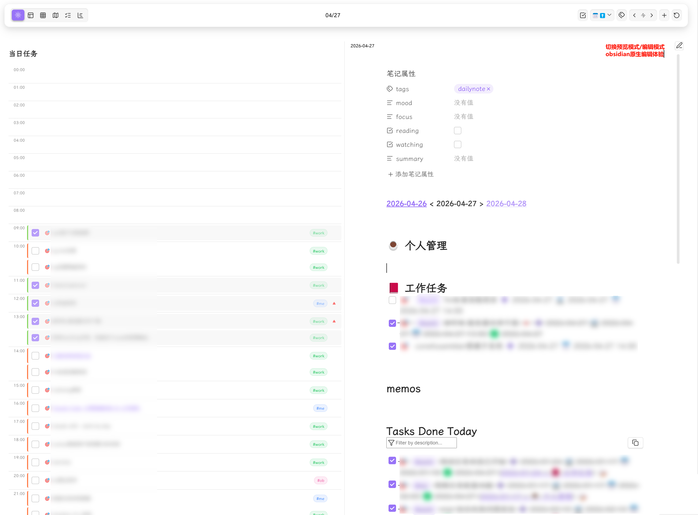

# Obsidian Gantt Calendar

[English](./README.md)

<div align="center" style="padding: 20px; border: 2px solid #8b5cf6; border-radius: 12px; background: linear-gradient(135deg, rgba(139, 92, 246, 0.05) 0%, rgba(59, 130, 246, 0.05) 100%); margin: 20px 0;">

一个强大的 Obsidian 任务管理和日历插件。

**多视图日历** — 任务视图/年/月/周/日/甘特图 六大视图自由切换

**节日显示** — 公历节日、农历节日、二十四节气

**数据可视化** — 任务热力图、每日任务数量统计、8 种渐变配色方案

**智能任务管理** — 全局筛选、优先级标记、6 种时间属性、时间精度(HH:mm)

**连续时间画布** — 周/日/侧栏视图分钟级定位时间轴：点击创建、边缘拉伸（15 分钟吸附）、所见即所得拖放与落点预览

**移动端就绪** — 长按底部菜单、触屏拖动、滑动翻页、响应式布局

**Daily Note 集成** — 嵌入式编辑器，编辑/预览模式切换

**侧边栏视图** — 任务搜索筛选排序 + 每日时间线

**高度可定制** — 节日颜色、热力图配色、任务显示数量等全面配置

**双格式兼容** — 完美支持 Tasks 插件（emoji）与 Dataview 插件（字段）格式

**周期任务** — 支持 daily/weekly/monthly/yearly 重复任务显示

**飞书同步** — 通过 OAuth 2.0 实现飞书任务双向同步

</div>

---

## 截图

年视图


甘特视图


周视图时间轴模式


侧边栏视图（任务列表 + 每日时间线）


日视图嵌入式编辑器


## 安装

### 通过 BRAT 安装

1. 安装并启用社区插件 [BRAT](https://github.com/TfTHacker/obsidian42-brat)
2. 执行命令 `BRAT: Add a beta plugin for testing`
3. 填写仓库地址：`https://github.com/sustcsugar/obsidian-gantt-calendar`

### 手动安装

1. 下载最新的 [Release](https://github.com/sustcsugar/obsidian-gantt-calendar/releases)
2. 解压后将文件夹复制到 `<你的库>/.obsidian/plugins/`
3. 重启 Obsidian 并在设置中启用插件

## 快速开始

### 打开视图

- 点击侧边栏**图标按钮**打开主日历视图
- 使用工具栏中的**视图切换**按钮在视图间切换

### 创建任务

使用工具栏右侧的**添加任务**按钮，或在任意 Markdown 文件中手动编写：

```markdown
- [ ] 🎯 完成项目文档 📅 2025-12-20
```

刷新插件即可在日历和任务列表中看到该任务。

## 功能特性

### 界面布局

插件采用**顶部工具栏 + 内容区**的布局结构：

- **工具栏左侧** — 视图切换（6 个视图）
- **工具栏中间** — 当前日期范围 / 标题
- **工具栏右侧** — 功能按钮（导航、排序、筛选、添加任务等）

### 任务格式

**Tasks 插件格式（Emoji）**

```markdown
- [ ] 🎯 完成项目文档 ⏫ ➕ 2025-01-10 📅 2025-01-15
```

| Emoji | 含义 | Emoji | 含义 |
|-------|------|-------|------|
| `🎯` | 全局筛选标记 | `🔺` | 最高优先级 |
| `⏫` | 高优先级 | `🔼` | 中优先级 |
| `🔽` | 低优先级 | `⏬` | 最低优先级 |
| `➕` | 创建日期 | `🛫` | 开始日期 |
| `⏳` | 计划日期 | `📅` | 截止日期 |
| `✅` | 完成日期 | `❌` | 取消日期 |
| `🔁` | 重复任务 | - | - |

**Dataview 插件格式（字段）**

```markdown
- [ ] 🎯 完成项目文档 [priority:: high] [created:: 2025-01-10] [due:: 2025-01-15]
```

| 字段 | 含义 | 字段 | 含义 |
|------|------|------|------|
| `priority::` | 优先级 | `created::` | 创建日期 |
| `start::` | 开始日期 | `scheduled::` | 计划日期 |
| `due::` | 截止日期 | `completion::` | 完成日期 |
| `cancelled::` | 取消日期 | `repeat::` | 重复规则 |

**时间精度**

- 日期格式：`YYYY-MM-DD`（如 `2026-04-27`）
- 时间格式：`YYYY-MM-DD HH:mm`（如 `2026-04-27 14:00`）
- 包含时间的任务会自动在日视图和周视图中显示为时间轴布局

**重复任务语法**

```markdown
🔁 every day              # 每天
🔁 every 3 days           # 每3天
🔁 every week on Monday   # 每周一
🔁 every month on 15      # 每月15日
🔁 every year on 01-01    # 每年1月1日
🔁 every weekday          # 每个工作日
🔁 when done              # 完成后重新开始
```

### 年视图

- **全年概览** — 12 个月卡片展示全年任务分布
- **任务热力图** — 5 级颜色梯度，直观显示任务密度
  - 8 种配色方案：蓝 / 绿 / 红 / 紫 / 橙 / 青 / 粉 / 黄
  - 3D 热力图效果（关闭 / 轻微凸起 / 明显凸起）
- **响应式布局** — 根据窗口宽度自动切换 4×3 / 3×4 / 2×6 / 1×12 布局
- **任务数量统计** — 可选显示每日任务总数
- **农历显示** — 月卡片内显示农历日期
- **点击导航** — 点击日期切换到日视图

### 月视图

- **月度日历** — 标准月历布局，清晰显示每日任务
- **周数显示** — ISO 周数显示在每周第一列
- **任务数量限制** — 可配置每天显示任务数量（1–10），超出显示"+N 更多"
- **任务弹窗** — 点击日期显示当天完整任务列表
- **节日显示** — 阳历/农历/节气节日三色标记
- **拖拽排序** — 拖拽任务卡片在日期间移动
- **周期任务** — 自动显示重复任务的虚拟实例
- **周起始配置** — 支持周一/周日开始

### 周视图

- **双模式布局**
  - **列表模式** — 当周内无定时任务时，显示 7 列卡片布局
  - **时间轴模式** — 检测到定时任务时自动切换，显示 24 小时纵向时间轴，7 天并排对齐
- **今日高亮** — 当天日期特殊标记
- **灵活导航** — 上一周 / 本周 / 下一周快速切换
- **拖拽交互** — 拖拽任务到任意天或小时格
- **快速创建** — 空时间格悬停显示"+"按钮，点击快速创建任务
- **当前时间线** — 红色指示线标记当前时刻
- **农历信息** — 日期栏显示农历文本和节日

### 日视图

- **详细任务列表** — 显示当天所有任务详情
- **时间轴布局** — 当任务包含时间精度时，渲染 0:00–23:00 时间轴，任务定位到对应小时格
- **拖拽交互** — 拖拽任务到任意时间格调整时间
- **快速创建** — 空时间格悬停显示"+"按钮
- **当前时间线** — 红色指示线标记当前时刻
- **Daily Note 集成**
  - 嵌入式完整编辑器（WorkspaceSplit 模式）
  - 编辑 / 预览模式切换
  - 自动加载对应日期的 daily note
  - 支持 Obsidian 核心日记插件、Periodic Notes 插件和自定义路径
- **可调整分栏** — 任务区与笔记区之间可拖拽调整大小（水平或垂直布局）
- **农历信息栏** — 显示农历日期、节日、节气

### 任务视图

- **任务列表** — 集中展示所有任务
- **日期范围筛选** — 全部 / 今天 / 本周 / 本月 / 自定义范围
- **时间字段选择** — 按任意 6 种日期字段过滤
- **多维筛选** — 状态、优先级、标签（AND/OR/NOT 运算符）
- **排序** — 7 种排序字段，支持升序/降序切换
- **状态持久化** — 筛选和排序设置刷新后保留

### 甘特视图

- **交互式甘特条** — 自定义 SVG 渲染引擎
  - 拖动整体任务条调整时间
  - 拖动左右端点调整开始/结束时间
  - 拖动调整任务进度百分比
  - 点击打开任务编辑弹窗
- **导航按钮** — 跳转到今天 / 向左 / 向右滚动
- **增量刷新** — 智能更新策略，避免全量重绘
- **标签/状态筛选** — 按标签和任务状态过滤甘特条
- **可配置字段** — 选择映射到甘特图起止时间的日期字段

### 侧边栏视图

两个标签页，方便随时查看和管理任务：

**任务列表标签页**
- 关键词搜索（防抖处理）
- 多维筛选：状态、优先级、标签（OR/AND）、日期范围
- 排序：优先级 / 截止日期 / 开始日期
- 点击任务卡片跳转到源文件

**每日时间线标签页**
- 24 小时时间格展示今日定时任务
- 全天任务区域
- 当前时间指示线（实时标记）
- 拖拽任务调整时间
- 空时间格快速创建

### 右键菜单

右键点击任意任务可执行：

- **编辑任务** — 完整编辑弹窗（描述、优先级、日期、重复、标签）
- **创建笔记** — 从任务生成 wiki 链接笔记（同名或别名）
- **设置优先级** — 6 个等级：最高 / 高 / 中 / 普通 / 低 / 最低
- **设置状态** — 自定义状态（重要、有疑问）
- **延期任务** — 延迟 1/3/7 天（从截止日期或从今天算起）
- **取消 / 恢复** — 切换任务取消状态
- **删除** — 从 Markdown 文件中移除任务

### 飞书同步

- **双向同步** — 将本地任务推送到飞书，从飞书拉取任务到 Obsidian
- **OAuth 2.0** — 安全认证，自动刷新令牌
- **推送过滤** — 按文件路径、完成状态、日期筛选
- **冲突解决** — 多种策略：本地优先 / 远程优先 / 最新优先 / 手动
- **自动同步** — 可配置自动同步间隔
- **同步结果弹窗** — 详细的逐任务同步结果和统计信息

## 开发路线图

### 任务解析
- [x] Tasks 和 Dataview 双格式任务解析
- [x] 全局筛选标记
- [x] 任务标签
- [x] 任务描述
- [x] 6 种优先级
- [x] 6 种时间属性（含时间精度 HH:mm）
- [x] 重复任务识别与显示
- [ ] 嵌套标签识别
- [ ] 多行任务识别
- [ ] 子任务识别
- [ ] 任务依赖关系

### 视图功能
- [x] 日视图 Daily Note 集成（嵌入式编辑器）
- [x] 日视图时间轴布局
- [x] 周视图双模式（列表 + 时间轴）
- [x] 周/月视图拖拽
- [x] 年视图热力图和任务统计
- [x] 任务视图（多维筛选 + 日期范围）
- [x] 甘特视图（拖拽 + 增量刷新 + 导航）
- [x] 侧边栏视图（任务列表 + 每日时间线）

### 工具栏
- [x] 视图切换
- [x] 标签 / 状态 / 优先级筛选
- [x] 日期导航按钮
- [x] 时间字段选择
- [x] 添加任务按钮

### 交互功能
- [x] 任务卡片（描述、标签、优先级）
- [x] 右键菜单（编辑、创建笔记、优先级、状态、延期、取消、删除）
- [x] 悬浮提示
- [x] 空时间格快速创建

### 未来计划（v2.0.0）
- [ ] 第三方日历订阅（飞书日历、Outlook 日历）
- [ ] Microsoft To Do 同步
- [ ] 通过 CalDAV 接入 Google / Apple 日历

## 贡献

欢迎提交 Issue 和 Pull Request！

## 许可证

[MIT](LICENSE)

---

<div align="center">

遇到问题或有建议？提交 [Issue](https://github.com/sustcsugar/obsidian-gantt-calendar/issues)

喜欢这个插件？给我一个 ⭐！

</div>
